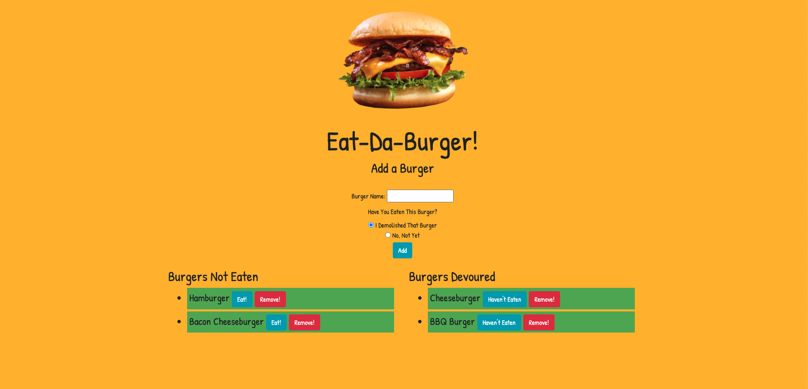

# burger

## Table of Contents 
* [Description](#description)
* [Installation](#installation-of-repo)
* [Usage](#usage)
* [Contributing](#contributing)
* [Questions](#questions)
* [Screenshot](#screenshot)
* [Walk-Through-Video](#walk-through-vid)
* [Credits](#credits)
* [License](#license)

## Description
Ear-Da-Burger is a simple restaurant app that allows users to input the names of burgers they would like to eat. 

## Installation
Follow these steps to view the application!
1. Open link in github. - https://github.com/xdanielmtz/burger
2. Clone with SSH
3. Run "git clone" command in Terminal with the pasted link
4. Run "code ." command to open in VS Code.
5. Run 'npm install' to install all dependencies 
6. Run 'npm start' to initialize the server on your local if you wish to view it there.
7. Enjoy

## Usage
When opening the web application, you will be presented with a input box in which you can enter your desired burger. 
You will then choose on whether you have devoured the burger or not. Only then after you choose, you can add it.
Once added, it will go into one of the two columns available. The column on the left is for burgers you have not eaten and on the 
right column is for burgers you have eaten. Each burger on the list will have a remove button allowing you to do just that. The burger in 
the lists will also have a 'Eat' and 'Haven't Eaten' button depending on which column they are in. 

## Contribution 
IF you wish to contribute, here is how:
GO to my repo and fork my repository.
CLONE with ssh and view it on your local machine.
WHEN you have made your contributions, run git push and I will review for a merge.

## Questions
If you have any questions contact me through email, xdanielmtz@gmail.com
Also here is my github profile, https://github.com/xdanielmtz
Additionally, you can view my portfolio page for additional information: https://xdanielmtz.github.io/responsive-portfolio/index.html

## Screenshot

## Walk-through Vid:
https://drive.google.com/file/d/1bTbeodEzxzd7vdLnBO8WVJ7ff92EsS-M/view

## Credits 
I would like to give credit to my instructor as always, Jonathan Watson. He provided me with the information required to complete this project. 

## License 
MIT License

Copyright (c) 2020 xdanielmtz

Permission is hereby granted, free of charge, to any person obtaining a copy
of this software and associated documentation files (the "Software"), to deal
in the Software without restriction, including without limitation the rights
to use, copy, modify, merge, publish, distribute, sublicense, and/or sell
copies of the Software, and to permit persons to whom the Software is
furnished to do so, subject to the following conditions:

The above copyright notice and this permission notice shall be included in all
copies or substantial portions of the Software.

THE SOFTWARE IS PROVIDED "AS IS", WITHOUT WARRANTY OF ANY KIND, EXPRESS OR
IMPLIED, INCLUDING BUT NOT LIMITED TO THE WARRANTIES OF MERCHANTABILITY,
FITNESS FOR A PARTICULAR PURPOSE AND NONINFRINGEMENT. IN NO EVENT SHALL THE
AUTHORS OR COPYRIGHT HOLDERS BE LIABLE FOR ANY CLAIM, DAMAGES OR OTHER
LIABILITY, WHETHER IN AN ACTION OF CONTRACT, TORT OR OTHERWISE, ARISING FROM,
OUT OF OR IN CONNECTION WITH THE SOFTWARE OR THE USE OR OTHER DEALINGS IN THE
SOFTWARE.
